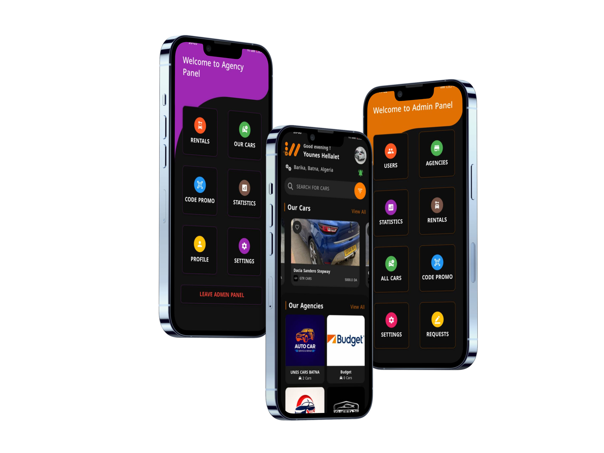

[contributors-shield]: https://img.shields.io/github/contributors/Kind-Unes/Balagh-Islamic-Dawaa-App.svg?style=for-the-badge
[contributors-url]: https://github.com/Kind-Unes/Balagh-Islamic-Dawaa-App/graphs/contributors
[forks-shield]: https://img.shields.io/github/forks/Kind-Unes/Balagh-Islamic-Dawaa-App.svg?style=for-the-badge
[forks-url]: https://github.com/Kind-Unes/Balagh-Islamic-Dawaa-App/network/members
[stars-shield]: https://img.shields.io/github/stars/Kind-Unes/Balagh-Islamic-Dawaa-App.svg?style=for-the-badge
[stars-url]: https://github.com/Kind-Unes/Balagh-Islamic-Dawaa-App/stargazers
[issues-shield]: https://img.shields.io/github/issues/Kind-Unes/Balagh-Islamic-Dawaa-App.svg?style=for-the-badge
[issues-url]: https://github.com/Kind-Unes/Balagh-Islamic-Dawaa-App/issues
[license-shield]: https://img.shields.io/github/license/Kind-Unes/Balagh-Islamic-Dawaa-App.svg?style=for-the-badge
[license-url]: https://github.com/Kind-Unes/Balagh-Islamic-Dawaa-App/blob/master/LICENSE.txt
[linkedin-shield]: https://img.shields.io/badge/-LinkedIn-black.svg?style=for-the-badge&logo=linkedin&colorB=555
[linkedin-url]: https://linkedin.com/in/younes-hellalet
[Next.js]: https://img.shields.io/badge/next.js-000000?style=for-the-badge&logo=nextdotjs&logoColor=white
[Next-url]: https://nextjs.org/
[React.js]: https://img.shields.io/badge/React-20232A?style=for-the-badge&logo=react&logoColor=61DAFB
[React-url]: https://reactjs.org/
[Vue.js]: https://img.shields.io/badge/Vue.js-35495E?style=for-the-badge&logo=vuedotjs&logoColor=4FC08D
[Vue-url]: https://vuejs.org/
[Angular.io]: https://img.shields.io/badge/Angular-DD0031?style=for-the-badge&logo=angular&logoColor=white
[Angular-url]: https://angular.io/
[Svelte.dev]: https://img.shields.io/badge/Svelte-4A4A55?style=for-the-badge&logo=svelte&logoColor=FF3E00
[Svelte-url]: https://svelte.dev/
[Laravel.com]: https://img.shields.io/badge/Laravel-FF2D20?style=for-the-badge&logo=laravel&logoColor=white
[Laravel-url]: https://laravel.com
[Bootstrap.com]: https://img.shields.io/badge/Bootstrap-563D7C?style=for-the-badge&logo=bootstrap&logoColor=white
[Bootstrap-url]: https://getbootstrap.com
[JQuery.com]: https://img.shields.io/badge/jQuery-0769AD?style=for-the-badge&logo=jquery&logoColor=white
[JQuery-url]: https://jquery.com

# **Clothes Store Application Almasa**

[![Contributors][contributors-shield]][contributors-url]
[![Issues][issues-shield]][issues-url]
[![LinkedIn][linkedin-shield]][linkedin-url]

<table border="1" align="center">
  <thead>
    <tr>
      <th>Application's Poster</th>
    </tr>
  </thead>
  <tbody>
    <tr>
      <td align="center">
         
      </td>
    </tr>
  </tbody>
</table>

# **App Logo & Download**

<table border="1" width="100%" align="center">
  <thead>
    <tr>
      <th colspan="2">App Logo & Download</th>
    </tr>
  </thead>
  <tbody>
    <tr>
      <td align="center" width="50%">
        
      </td>
      <td align="center" width="50%">
        <h2>Launching on April 10, 2025, for:</h2>
        

       

          
          
       

      </td>
    </tr>
  </tbody>
</table>

# **Source Code & Description**

<table border="1" width="100%" align="center">
  <thead>
    <tr>
      <th colspan="2">Source Code & Description</th>
    </tr>
  </thead>
  <tbody>
    <tr>
      <td align="center" width="50%">
        <h2>App Description</h2>
        

        A Flutter-based car rental application suite, including apps for users, admins, and agencies, streamlining car rental bookings, management, and agency coordination.
        

      </td>
      <td align="center" width="50%">
        <h2>Source Code</h2>
        
Please apply via this button for source code access. We do this to ensure that only authorized individuals can obtain the code and to maintain control over its distribution.

        
      </td>
    </tr>
  </tbody>
</table>

# **Screenshots (Users Applications)**

# **Users Application**

 
 
 
 
 
 
 
 
  
  
  
 
  
  
  
 
 
 
 
 
 

# **Agencies Application**

 
 
 
 
 
 
 
 
 
 
 
 
 
 
 
 
 
 
 
 

# **Admins Application**

  
  
  
 
 
  
  
 
 
  
 
  
 

# **For More Info:**

- Contact Me: Hellalet Younes
- Email: hellalet.younes@gmail.com
- Phone: +213 558466741
